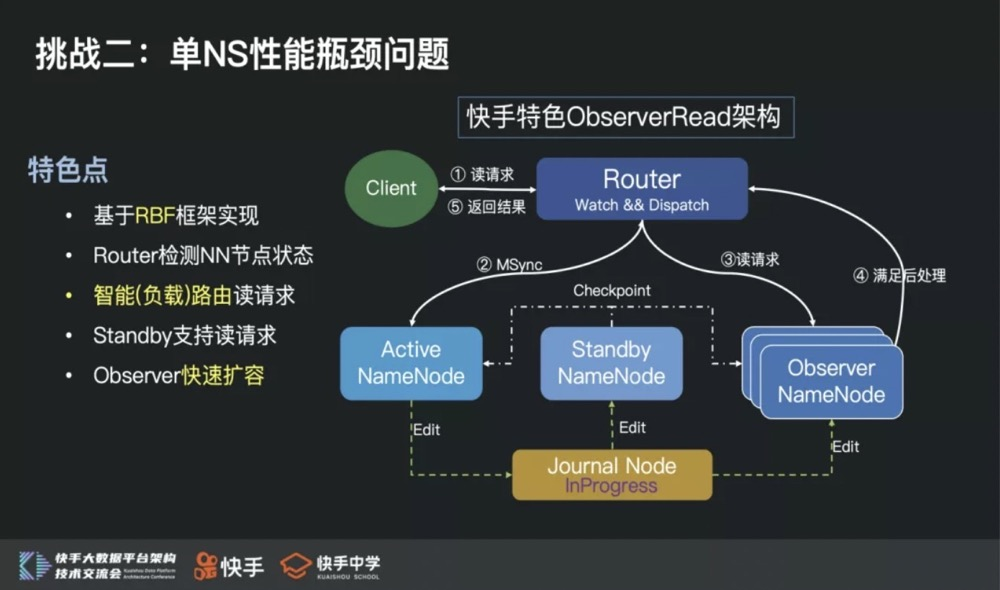

2021.3.29

HDFS
* 主节点扩展性问题
    * 具备快速新增NameService的能力
    * 具备新增NS能快速分担现存NS压力的能力

HDFS 3.0
RBF： Router Based Federation
- 

DFBH（Dynamic fixed-order based hash）机制：
来解决主节点扩展性问题：
* 通过一致性Hash实现多NS间Qps负载均衡
* 利用动态FixedOrder机制，在不搬迁数据的场景下，实现透明扩缩容NS
  实现的核心思想是：
* 每个路径依据多组一致性Hash列表计算出归属NS，组合成FixedOrder
* 将增量数据写到期望NS 中 ，存量数据依旧可见
* 随着生命周期推移，逐步回退到最普通的一致性Hash策略

HDFS 架构中NameNode 的实现中有一把全局锁，很容易就达到处理瓶颈。
社区最新3.0提出了一个Observer Read架构，通过读写分离的架构，尝试提升单个NameService的处理能力

* 单NS性能瓶颈问题
    - 

  - 快手特色ObserverRead架构有几个非常明显的优势：
    * 整个架构，基于RBF框架实现，客户端完全透明
    * Router检测NN节点状态，实现动态负载路由读请求
    * Standby、Active节点可以支持读请求
    * Observer节点支持快速扩容
      在整个最新架构落地过程中，也解决了社区ObserverRead架构大量稳定性问题，比如：
    * MSync RPC稳定性问题
    * Observer Reader卡锁问题
    * NameNode Bootstrap失败问题
    * Client Interrupt导致无效重试问题（HDFS-13609)

* 节点问题
  慢节点会导致长尾Task, 任务卡住
  慢节点问题主要体现在从节点DataNode上，主要是因为物理指标负载比较大，比如：网卡流量、磁盘Util、Tcp 异常等。
  1.慢节点规避
  实现规避：根据负载情况将Datanode进行排序，优先返回低负载节点
  事中熔断：根据客户端读写请求，通过吞吐阈值实时感知慢节点，对慢节点进行下线
  2.慢节点根因优化
  （1）在线目录层级降维：blockc存储目录层级降维，元数据信息缩减
  （2）DataSet全局锁优化：将全局锁细粒度化，拆分为BlockPool + Volume, 降低Block之间，磁盘之间的影响
  （3）DU操作优化：定期DU，通过内存结构计算单磁盘BP使用量
  （4）选盘策略：优先选择低负载磁盘

* 分级保障问题
    * 未满载时按照资源配比处理请求
    * 满载时按照优先级策略处理请求
