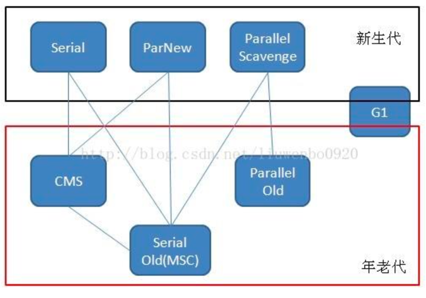
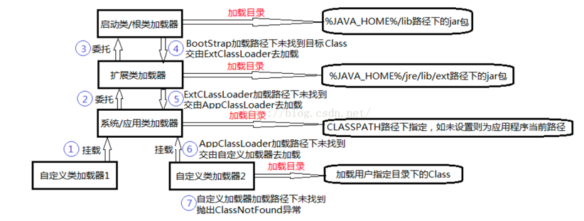
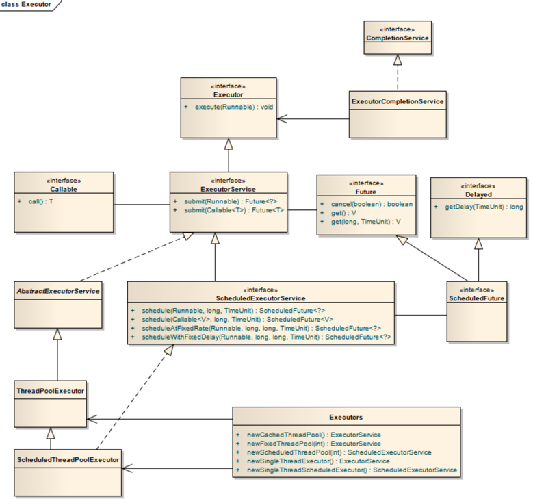
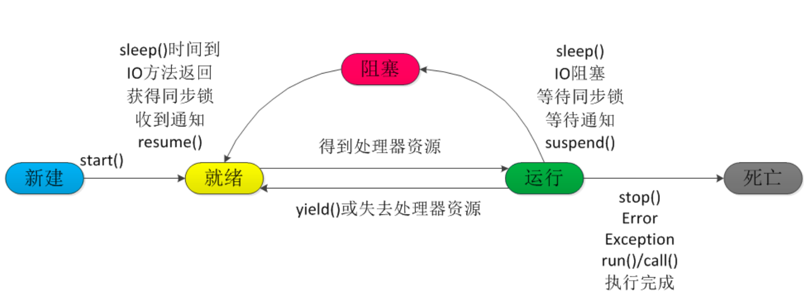
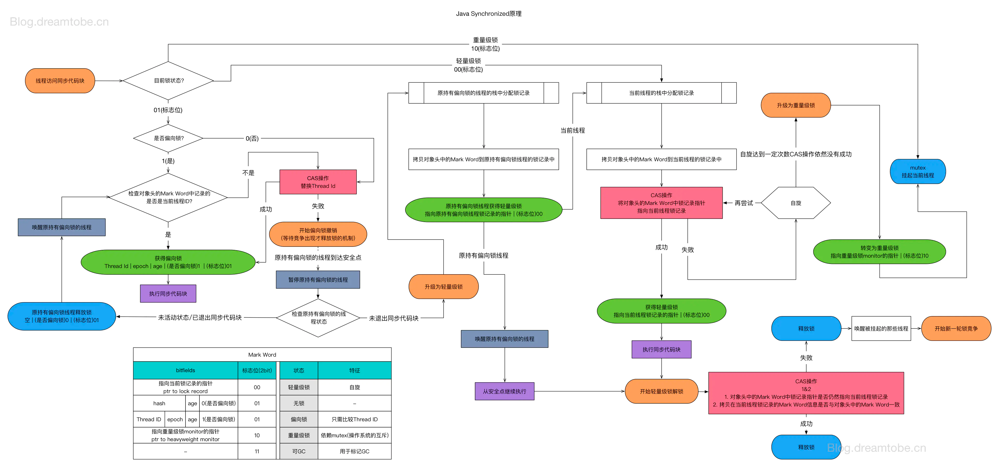
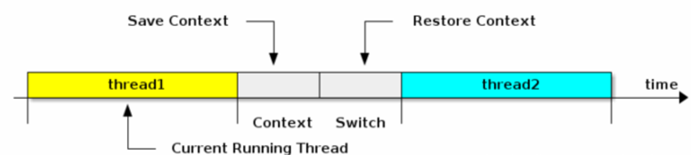
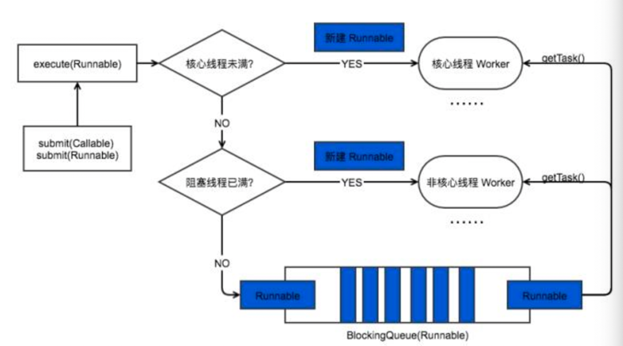
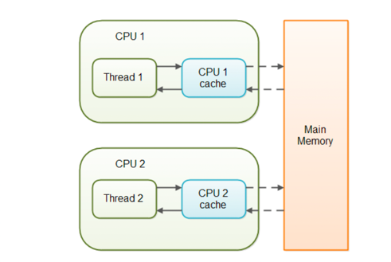

#### JVM
##### 线程私有内存区域
 - 程序计数器
   + 每个线程都有的独立内存
   + 当前线程所执行字节码行号的指示器
   + 内存区域唯一在虚拟机内没有OOM的区域
 - 虚拟机栈
   + 描述方法执行的内存模型，每个方法的运行都会创建一个栈帧
     + 局部变量表
     + 操作栈
     + 动态链接
     + 返回地址
 - 本地方法区
   + 与虚拟机栈（Java stack）类似，虚拟机栈为Java方法服务，本地方法区为Native方法服务

##### 线程共享内存区域
 - 堆
    + 对象数组存储区域，GC回收重要范围，堆从分代收集算法可分为（新生【Eden, From Survivor, To Survivor】, 老年代）
 - 方法区/永久代
    + 被JVM加载的类，常量，静态变量，即时编译的代码等
    + 使用java堆的GC分代来实现方法区(永久代)
    + 常量池的回收和类型的卸载，收益小

##### JVM 运行时内存
 - 新生代 1/3
   + Eden 8/10
     + 新分配内存过大，直接老年代
     + 内存不够触发MinorGC, 一次回收
   + SurvivorFrom 1/10
     + 上一次GC的幸存者，成为这一次GC的被扫描着
   + SurvivorTo 1/10
     + 保留了一次MinorGC的幸存者
> MinorGC(复制 -> 清空 -> 互换)
> > Eden, SurvivorFrom 复制到 SurvivorTo, 年龄 +1
> > > - Eden内存满，触发第一次GC，复制到From区
> > > - 再次满触发GC时，扫描Eden + From，将存活对象复制到 To 区，年龄+1
> > > - 年龄达到15且存活复制到老年代，年龄+1
> 
> > 清空
> > > - 清空 Eden + From 中的对象
>
> > 互换
> > > - To/From互换，这次的From成为下一次GC的To区

 - 老年代 2/3
    + 存放应用程序中生命周期长的内存对象
    + MajorGC之前一般会执行一次MinorGC, 使新生代对象晋升到老年代，内存不够用时触发
    + 当无法找到足够大的内存空间分配给新创建的对象时，会提前触发MajorGC
> MajorGC(标记清除算法)
> > 扫描整个老年代，标记出存活对象，然后回收没有被标记的对象
> > > - 扫描再回收耗时长
> > > - 通过合并减少内存碎片
> > > - 老年代无法存放的时候，报OOM

 - 永久代【非堆内存】
    + class 信息 + meta
    + GC 不会在主程序运行期间对永久区清理，所以class加载过多可能OOM
> Java8后移除永久代，取代为"元数据区"
> > 元空间使用本地内存
> > > - 类的元数据存放Native内存
> > > - 字符串池和类的静态变量存放Java堆
    
##### GC 算法
 - 如何确定垃圾？
    + 引用计数法
        + 在对象头部添加counter，引用时+1，不用时-1
        + counter = 0 表示可回收
    ```
    缺点:
        1. 无法表示引用的强软弱虚
        2. 对象之间循环引用，counter > 0，会造成死锁，永远无法GC
    ```
    + 可达性算法
        + 从GC Roots对象作为起始点，向下搜索，能链接上的对象为可达
        + GC Roots选择
            + 虚拟机栈栈帧局部变量表引用对象
            + 本地方法栈JNI(java native interface)引用对象
            + 方法区静态变量和常量引用对象
        + GC Roots链不可达对象会先标记，进行一轮筛选（是否有必要执行finalize），有则进入F-Queue,低优执行；GC将第二次对F-Queue小规模可达标记，不可达则回收
    
 - 标记清除算法
    + 标记需要回收对象，然后清除回收对象内存区域
    ```
    缺点：碎片化严重，大对象无法找到内存区域
    ```
    
 - 复制算法
    + 为解决标记清除碎片化问题
    + 将内存均分两份，每次只使用其中一半，将可用对象复制到另一份中
    ```
    缺点：
        1.内存区域使用空间降低一半
        2.大量内存处理时，复制较慢
    ```
    
 - 标记整理算法
    + 为解决上面两个问题
    + 标记步骤相同，标记后不是清除对象，将存活对象移动向一端，清除端边界外的对象
    + 停顿：移动式需要暂停用户操作，即达到安全点/安全区域
    
 - 分代收集算法
    + GC 堆不同区域使用不同的收集算法
        + 新生代会回收大量垃圾对象，复制量少 => 复制算法
        + 老年代回收较少对象 => 标记整理算法
    
 - 四种引用类型
    + 强引用：最常见，把对象赋给引用变量，一直可达，永不回收
    + 软引用：SoftReference，内存够时不回收，不够时回收
    + 弱引用：WeakReference，GC 运行则回收
    + 虚引用：PhantomReference，和引用队列一起使用，跟踪对象被回收的状态
    
 - 分代收集算法 VS 分区收集算法
    + 分代：不同代特点使用不同的收集算法
    + 分区：将堆分为连续独立小空间，单独回收，控制回收多少个空间，非全部回收，可减少GC停顿时间
    
 - 垃圾收集器

   + Serial (单线程 + 复制算法)：暂停工作进程 <font color=orange>jdk1.3</font>
   + ParNew (Serial 的多线程版本)：-XX:ParallelGCThreads设置线程数 <font color=orange>jdk1.4</font>
   + Parallel Scavenge (多线程复制, 高效)：自适应调节策略，高吞吐 <font color=orange>jdk1.4</font>
   + Serial Old (单线程 + 标记整理)：老年代 <font color=orange>jdk1.5</font>
   + Parallel Old (多线程标记整理算法)：老年代 <font color=orange>jdk1.6</font>
   + CMS (多线程标记清除算法 Concurrent mark sweep): 获取最短垃圾回收停顿时间，可达性分析清除 <font color=orange>jdk1.5</font>
     + 初始标记(暂停工作进程)
     + 并发标记(不暂停)
     + 重新标记(暂停)
     + 并发清除(不暂停)
   + G1 (标记整理 + 堆内存分区按优先级收集)：减少碎片，精确控制停顿时间，低停顿回收 <font color=orange>最新jdk</font>
    
 - 类加载器  
   加载 -> (连接Linking)[验证 -> 准备 -> 解析] -> 初始化 -> 使用 -> 卸载
    + 加载：获取类的入口，可以是class，jar, jsp等
        + 启动类加载器 JAVA_HOME/lib目录 或 -Xbootclasspath
        + 扩展类加载器 JAVA_HOME/lib/ext目录 或 java.ext.dirs
        + 应用类加载器 classpath下依赖
        
        + 双亲委派：尽量交给父类加载，找不到才给子类 (启动类 <- 扩展类 <- 应用类 <- 自定义)
        + OSGI(动态模型系统)：动态加载，热插拔
    + 验证：确保信息符合要求
    + 准备：分配变量使用内存空间，初始化类变量
    + 解析：将常量池中的符号引用替换成直接引用（直接引用：指针，偏移量，句柄等）
    + 初始化：执行类构造器
    

---
#### IO/NIO
 - JAVA IO/NIO
    + 阻塞IO: 线程等待数据到达，线程阻塞，交出CPU,一直处于block状态，数据接收后释放.[socket.read()]
    + 非阻塞IO: 线程一直占用CPU，等待想要的数据 [while(true)]
    + 多路IO复用: 一个线程不断轮训多个socket状态，只有真正有读写事件时，才调用实际的IO读写操作
        + 多路复用快于非阻塞IO原因：前者轮训socket状态是在内核进行，后者在用户进程
        + 事件响应体过大时，后续的事件处理延迟
    + 信号驱动IO: 用户线程发起IO请求，socket注册信号函数，内核数据就绪发送信号给用户线程，线程接收后，在信号函数调用IO读写操作
    + 异步IO: 发起read后，做别的操作，用户线程不会产生block。数据完成后拷贝到用户线程，完成后发送信号给用户线程，，read操作完成，无需用户线程去读

 - IO包
    + 字节流
      + InputStream
      + OutputStream
    + 字符流
      + Reader
      + Writer
 
- JAVA NIO
    + 三大核心：channel buffer selector
    + NIO基于channel buffer进行操作，数据从channel读取到buffer / 从buffer写到channel,selector耽搁线程轮训监听多个channel的状态
    + (ClientSocket -> SocketChannel)多个 -> Selector -> Buffer -> ProcessThread
    + IO是面向流，NIO面向缓冲区
    + NIO包
        + channels (channel是双向的，可读可写，普通IO的Stream是单向的)
        + charset
        + Buffer
        + ByteOrder
        + MappedByteBuffer
    + Channel
        + FileChannel 文件IO
        + DatagramChannel UDP
        + SocketChannel TCP client
        + ServerSocketChannel TCP server
    + Buffer 缓冲区，一个连续数组容器，数据的读写都必须经过buffer
        + Client -> Buffer -> Channel <--> Channel -> Buffer -> Server
    + Selector 单个线程检测多个Channel连接，避免多余开销和多线程之间的上下文切换
    

#### 集合
 + Collection
   + List
     + ArrayList
       + 有序，可重复
       + 底层使用数组，查询快，增删慢
       + 线程不安全
       + 扩容 = 当前 * 1.5 + 1
     + Vector
       + 有序，可重复
       + 底层使用数组，查询快，增删慢
       + 线程安全
       + 扩容 = * 2
     + LinkedList
       + 有序，可重复
       + 双向循环链表
       + 查询慢，增删快
       + 线程不安全
   + Set
     + HashSet
       + 无序，不可重复
       + Hash表实现 
         + hashcode + equals, hashcode相同且equals为true判断为同一元素
         + hashcode相同equals为false时存放一个桶
       + 存取速度快
       + 内部为HashMap
     + TreeSet
       + 无序，不可重复
       + 二叉树实现
       + 内部是TreeMap的SortedSet
     + LinkedHashSet
       + hash表存储，双向链表
       + 内部是LinkedHashMap
   + Queue
     + 两端出入的List
 + Map
   + HashMap
     + key不可重复，value可重复
     + hash表实现
       + HashMap内部是Entry数组
         ```
         static class Entry<K, V> implements Map.Entry<K, V> {
            final K key;
            V value;
            Entry<K, V> next;
            int hash;
         }
         ```
       + capacity 2^n,扩容都是2倍
       + loadFactor 0.75
       + threshold = capacity * loadFactor
       + Java8：当链表中元素超过8个，链表转换成红黑树，O(log2N)
     + 线程不安全 [ConcurrentHashMap、SynchronizedMap线程安全]
       + ConcurrentHashMap
         + Segment数组,Segment继承ReentrantLock,锁住一个segment保证全局线程安全
         + 默认16Segments,并发 = 16
     + key可null，value可null
   + HashTable
     + key不可重复，value可重复
     + hash表实现
     + 线程安全
       + 继承 Dictionary，单线程写操作，所以可用ConcurrentHashMap取代
     + key value 都不可为null
   + TreeMap
     + 二叉树实现
     + 键排序，必须实现Comparable或Comparator
    
#### 多线程
 - 线程创建
   + 无返回值 （实现Runnable）
     + 继承Thread，调用start方法（native方法），本质实现Runnable,调用了run
      ```
      class TestThread extends Thread {override run}
      thread = new TestThread
      thread.start()
      ```
     + 实现Runnable，调用run方法
      ```
      class TestRun extends OtherClass implements Runnable {override run}
      testRun = new TestRun()
      thread = new Thread(testRun)
      thread.start()
      ```
   + 有返回值 （实现Callable调用call(),获取Future对象）

 - 线程池 
   顶层接口ExecutorService.submit方法，Executor这是执行方法execute()

   + newCachedThreadPool
     + 根据需要创建新线程，线程重用，移除60s未使用的线程，无线程自动创建
   + newFixedThreadPool
     + 可重用固定线程数线程池
   + newScheduledThreadPool
     + 创建后，定期或延迟执行
    ```
    ScheduledExecutorService pool = Executors.newScheduledThreadPool(3)
    pool.shedule(new Runnable(){
        override void run() {
            sysout("延迟3秒")
        }
    }, 3, TimeUnit.SECONDS)
   
    pool.scheduleAtFixedRate(new Runnable(){
        override void run(){
            sout("一秒后开始执行，每3秒执行一次")
        }
    }, 1, 3, TimeUnit.SECONDS)
   ```
   + newSingleThreadExecutor
    单个线程的线程池，线程挂了会重启一个
    
 - 线程生命周期
   
    + 新建(NEW)：new后，分配内存，初始化成员变量
    + 就绪(RUNNABLE)：start()后，创建方法栈和程序计数器，等待调度
    + 运行(RUNNING)：获得CPU后，执行run()内方法体
    + 阻塞(BLOCKED)：因某些原因放弃CPU使用权,让出cpu time slice
        + 等待阻塞：运行中线程执行wait(), JVM会将线程放入等待队列 waiting queue
        + 同步阻塞：运行中获取对象同步锁，同步锁被占用, JVM将线程放入lock pool
        + 其他阻塞：运行中执行sleep(ms)/thread.join()/发出IO请求，JVM将线程置为阻塞状态。sleep超时/join线程终止或超时/IO处理完毕，线程重新进入可运行(RUNNABLE)
    + 死亡(DEAD)
        + 正常结束：run()/call()执行完成
        + 异常结束：Exception/Error
        + 调用Stop：可能会造成死锁
    
 - 终止线程方式
    + 程序运行结束
    + 退出标记 [while(exit)] volatile boolean exit [volatile修饰变量使其同步]
    + interrupt方法
        + 线程处于阻塞状态，sleep/wait，执行interrupt会抛出InterruptException，捕获后break跳出循环结束run方法
        + 非阻塞状态，使用isInterrupted判断线程是否中断
    + stop 线程不安全：调用后，子线程抛出ThreadDeathError，释放线程所有锁，数据可能不一致
    
 - 线程调用主要方法
    + sleep/wait
        + Thread.sleep()/Object.wait()
        + sleep()方法暂停执行对应时间，让出cpu，监控保持，指定时间到了自动恢复
        + sleep过程中，线程不会释放锁
        + wait方法，线程会释放锁，进入lock pool,调用notify后获取对象锁进入运行状态
    + join
        > 在当前线程调用另一个线程的join方法，当前方法转为阻塞，等到另一个线程结束，当前线程由阻塞转为就绪
    + yield 线程让步
        > 当前线程让出CPU执行时间片，与其他线程一起重新竞争CPU时间片
    + start/run
        + start调用进入就绪状态，run为线程体，进入后处于运行状态
        + run结束，线程终止，CPU调用下一个线程
    
 - 守护线程
    为用户线程提供公共服务，没有用户线程，守护线程会自动离开
    - 优先级较低
    - setDaemon(true)
    - 守护线程产生的子线程也是Daemon
    - GC线程属于守护线程，低级别运行，实时监控可回收资源
    
 - JAVA锁
    + 乐观锁 CAS操作
        - 认为读多写少，并发写的可能性低，不会直接上锁，<font color='green'>在更新的时候会判断一下在此期间有没有别人更新过数据，写时先读出当前版本号，然后加锁操作(比较上一次的版本号，如果一样更新，不一样 重复读->比较->写)</font>
    + 悲观锁
        - 认为写多，并发写的可能性高，每次读写数据都会上锁。Synchronized/ReentrantLock
        - Sync 继承自 AQS 框架, 先通过 CAS 获取锁，获取不到转换成悲观锁，用ReentrantLock
    + 自旋锁
        - 如果持有锁的线程能在很短时间内释放锁，那么等待的线程不需要由内核态切换到用户态，进入阻塞，等待锁释放立即获取锁，避免切换带来的消耗。
        - 自旋需要设定最大等待时间，超过时间停止自旋进入阻塞
    ```
    对于锁竞争不激烈，占用时间非常短的线程性能大幅提升，避免线程两次上下文切换
    对于锁竞争激烈的，自旋锁在获取前一直占用cpu做无用功，占着那啥不那啥，造成资源浪费
   ```
        - 1.6引入适应性自旋锁：CPU状态来优化自旋周期
    + Synchronized同步锁
        + 将任意非NULL对象当锁，独占式悲观锁，可重入锁
        + 作用范围
            + 方法上，对象实例 this
            + 静态方法上，Class实例，方法区永久代，全局锁
            + 对象实例，锁住的是以该对象为锁的代码块
        + 核心组件
            + Wait Set：调用wait后阻塞的线程
            + Contention List: 竞争队列，包含所有请求锁的线程
            + Entry List: ContentionList中有资格候选资源的线程
            + OnDeck: 任意时刻,最多只有一个线程正在竞争锁资源，该线程被称为OnDeck
            + Owner: 获取到锁资源的线程
            + !Owner: 当前释放锁的线程
        + 实现
            1. JVM每次从队尾取出一个数据作为锁竞争候选者(OnDeck)，但并发时ContentionList被大量并发线程CAS访问，为降低队尾元素竞争，JVM将部分线程移动到EntryList
            2. Owner线程在unlock时，将ContentionList部分线程迁移到EntryList, 并指定EntryList中某个线程为OnDeck线程(一般是最先进去的线程)
            3. Owner不直接传递锁给OnDeck，让OnDeck线程重新竞争锁，提高吞吐量 "竞争切换"
            4. OnDeck线程获取锁之后成为Owner线程，Owner线程被wait后，转移到WaitSet,直到被notify,重新进入EntryList
            5. ContentionList/EntryList/WaitSet 中线程都处于阻塞，由操作系统完成（内核采用pthread_mutex_lock）
            6. Synchronized是非公平锁，线程进入ContentionList时，会先自旋获取锁，获取不到进入ContentionList,对于ContentionList/EntryList中的线程不公平，对OnDeck线程不公平
            7. 每个对象都有monitor对象，加锁就是竞争monitor对象，代码块锁就是前后添加monitorenter/monitorexit，方法锁加标记
            8. synchronized需要调用操作系统相关接口，性能低效；1.7以后引入偏向锁/轻量级锁，在对象头加标记位，不经过操作系统加锁
            9. 锁膨胀：偏向锁 -> 轻量级锁 -> 重量级锁
    + ReentrantLock
        + 继承Lock，可重入锁，能覆盖synchronized所有功能，提供可相应中断锁/可轮询锁请求/定时锁等避免多线程死锁方法
        + 接口
            + void lock(): 锁空闲则线程获取锁，不空闲，会禁用当前线程，直到获取锁
            + boolean tryLock(): 锁空闲获取锁返回true,否则false，不禁用线程
            + void unlock(): 释放线程持有锁
            + hasQueuedThread(Thread thread): 查询给定线程是否等待获取
            + hasQueuedThreads(): 是否有线程等待
            + isFair(): 是否为公平锁
            + isHeldByCurrentThread(): 当前线程是否禁用，调用lock
            + isLock(): 是否有线程占用锁
            + condition.await(): 调用时，对象必须已获取到锁
       ```
        public class Service {
            private Lock lock = new ReentrantLock()
            // Lock fairLock = new ReentrantLock(true) // 公平锁
            // Lock unfairLock = new ReentrantLock(false) // 非公平锁
            Condition condition = lock.newCondition()
        
            public void test(){
                try{
                    lock.lock()
                    condition.await()   // 必须先执行lock.lock()
                    condition.signal()  // 唤醒wait线程
                } catch (InterruptException e) {
                    e.printStackTrace()
                } finally {
                    lock.unlock()
                }
            }
        }
      ```
    + 可重入锁（递归锁）
        > 可重入锁也叫递归锁，指同一线程<font color='orange'>外层函数获取锁后，内层也处于锁状态影响</font>，ReentrantLock、Synchronized都为可重入锁。
    + 非公平锁
        > JVM 按照随机、就近原则分配锁的机制。 <font color = 'orange'>ReentrantLock默认初始化为非公平锁，且执行效率远高于公平锁，因为公平锁需要维护多核下的队列</font>
    + 公平锁
        > 先请求者先获取锁，分配机制公平。 <font color='orange'>ReentrantLock提供公平锁初始化</font>
    + ReentrantLock与Synchronized
        + ReentrantLock通过lock/unlock加锁解锁，与Synchronized可以被JVM自动解锁机制不同，ReentrantLock加锁后需要手动释放，使用ReentrantLock必须在finally进行unlock操作
        + ReentrantLock优势：可中断、公平锁、多个锁
        + 相同点
            + 都是可重入锁，同一线程可以多次获得同一个锁
            + 保证可见性和互斥性
        + 不同点
          
          |<font color='orange'>ReentrantLock|<font color='orange'>Synchronized|
          |:----:|:----:|
          |显式获取释放锁|隐式|
          |可响应中断|不可中断|
          |API级别|JVM级别|
          |可以实现公平非公平锁|非公平锁|
          |乐观并发|悲观并发|
          |无论是否异常，都需手动释放锁|异常会自动释放锁|
          |可让等待锁线程响应中断|一直等待无法响应|
          |可以知道是否成功获取锁|不知道|
          |可响应中断|不可中断|
          |通过lock实现读写锁|-|
    + Condition与Object锁方法区别
        + condition.await() = obj.wait()
        + condition.signal() = obj.notify()
        + condition.signalAll() = obj.notifyAll()
        + ReentrantLock唤醒指定条件线程，obj唤醒线程随机
    + tryLock/lock/lockInterruptibility
        + tryLock: 尝试获取锁，不能返回false，能占用锁返回true
        + lock: 获取锁返回true,获取不到会一直等待
        + lockInterruptibility: 中断线程会抛出异常，lock不会
    + Semaphore 信号量
        + 基于计数的信号量，设定阈值，多个线程获取许可信号，做完操作后归还，超过阈值后阻塞，可构建连接池
        + 实现互斥锁(计数器为1)
        + 基本能完成ReentrantLock所有工作
        + 实现了可轮询锁请求、定时锁
        ```
        Semaphore semp = new Semaphore(1)
        try {
            // 申请许可
            semp.acquire();
      
            try {
                // 业务逻辑
            } catch (Exception e) {
                // 异常处理
            } finally {
                // 释放许可
                semp.release();
            }
        } catch (InterruptedException e) {
        }
      ```
    + CountDownLatch 线程计数器
        > 一个线程需要等待其他线程执行完后才执行，不能重用
    + CyclicBarrier 回环栅栏
        > 等待所有线程都到达某一个状态，全部同时执行，可重用
    + AtomicInteger
        > 提供原子操作，++i 或 i++ 不具有原子性，Synchronized能定义为原子操作，JVM特意提供AtomicInteger,效率高于ReentrantLock
      > > AtomicReference<V> 将对象操作转化成原子操作
    + 读写锁
        > 读的地方使用读锁，写的地方使用写锁
      > > 允许一个资源被多个线程读访问或被仅一个线程写操作访问，但两者不能同时进行
    + 共享锁/独占锁
        + 共享锁：乐观锁，允许多个线程同时获取锁，并发访问共享资源（读写锁）
            + AQS 内部类Node定义常量SHARED/EXCLUSIVE标识线程锁获取模式
        + 独占锁：悲观锁，每次只能有一个线程持有锁，ReentrantLock为独占实现的悲观锁，限制了读并发
    + 重量级锁 Mutex Lock
        > Synchronized 通过对象内部的monitor实现，本质依赖于底层操作系统mutex lock实现，操作系统实现线程切换需要从用户态到核心态，成本高，耗时长
      > > 这种依赖于操作系统 Mutex lock 实现的锁称为重量级锁
      > > >1.6以后引入轻量级锁和偏向锁
    + 轻量级锁
        + 无实际竞争，在每次申请和释放时CAS，发生锁竞争时，膨胀为重量级锁
    + 偏向锁
        + 无实际竞争，且线程仅有1个，偏向锁只需要初始化时一次CAS
    
    + 分段锁
        > 分段锁是一种思想，类似于 ConcurrentHashMap
    + 锁优化
        + 减少锁持有时间
        + 减小锁粒度：下沉，降低锁竞争，偏向锁，轻量级锁成功率提高
        + 锁分离：读写分离
        + 锁粗化：频繁请求释放锁，消耗性能，所以需要有度
        + 锁消除：编译器发现不可能被共享的对象，消除锁
    
 - 线程上下文切换
    > CPU给每个任务服务一定时间，然后保存当前任务状态，加载下一个任务，任务状态的保存再加载，为线程上下文切换
   > 
    + 进程：程序运行实例
    + 上下文：某一时间点CPU寄存器和程序计数器内容
    + 程序计数器：表明指令序列中CPU正在执行和下一个执行的指令位置
    + 切换帧 PCB: 上下文切换的信息保存在PCB(process control block)中
    + 上下文切换活动
        1. 挂起一个进程，将CPU中的上下文保存到内存中
        2. 内存中检索下一个进程的上下文放到CPU寄存器中恢复
        3. 跳转到程序计数器所指的位置（代码中断行），恢复该进程

 - 同步锁、死锁
    + 同步锁
        > 多个线程访问同一个数据，保证线程同步互斥
    + 死锁
        > 多个线程同时被阻塞，互相等待资源释放

 - 线程池原理 （线程复用，最大并发数，线程管理）
    + 线程复用：不断循环从Queue中获取Runnable对象
    + 组成部分
        + 线程池管理器：创建并管理线程池
        + 工作线程：线程池中的线程
        + 任务接口：每个任务必须实现的接口，用于工作线程调度运行
        + 任务队列：存放待处理的任务
    + 拒绝策略 【实现了 RejectedExecutionHandler】
        > 线程池中线程用完，等待队列占满，需要拒绝策略处理
        + AbortPolicy: 直接抛出异常
        + CallerRunsPolicy: 直接在调用者线程中运行
        + DiscardOldestPolicy: 丢弃最老的请求
        + DiscardPolicy: 丢弃无法处理的任务
    
    + 阻塞队列
        1. 当队列中没有数据时，消费端所有线程自动阻塞，知道有数据
        2. 当队列填满数据，生产者端所有线程自动阻塞，直到有空的位置，自动唤醒

 - volatile
    + 变量可见性
        > 保证该变量对所有线程可见，一个线程修改了变量值，新的值对于其他线程是可以立即获取
    + 禁止重排序
        > 访问volatile变量时不会加锁操作，不会使执行线程阻塞。比Synchronized更轻量级的同步机制
    + 适用场景
        > 对volatile变量的单次读写操作可以保证原子性，但不能保证i++原子，本质上i++是读写两次操作
      > > 1. 对变量的写操作不依赖于当前值（i++），只能是单纯的变量赋值操作 (boolean flag = true)
      > > 2. 不同volatile之间不能相互依赖
    
    > 1. 非volatile变量进行读写时，每个线程先从内存copy到CPU缓存，如果计算机有多个CPU,每个线程在不同的CPU上处理
    > 2. volatile修饰的变量，JVM保证了每次都从内存中读，跳过CPU cache

 - ThreadLocalMap 线程本地存储
    > 仅在生命周期内有效，避免公共变量数据传递复杂度
 
 - ConcurrentHashMap 并发
    + 减小锁粒度/segment，削弱多线程锁竞争
    + 一个ConcurrentHashMap被分割为16个segment，put操作根据hash锁定其中一个segment
    + segment数组和hashEntry数组组成ConcurrentHashMap
        > 1. segment为可重入锁ReentrantLock，在ConcurrentHashMap中扮演锁的角色
        > 2. hashEntry存储键值数据
        > 3. segment/hashEntry为数组+链表结构，一个segment包含一个hashEntry数组，每个元素是链表

 - 线程调度
    + 抢占式调度：不会因一个线程阻塞整个进程阻塞，但是线程执行时间片不可控
    + 协同式调度：接力，可能因一个线程阻塞导致崩溃
    + JVM线程调度实现(抢占式)：根据优先级分配时间片，只是占用时间片长短，所以优先级低不会获取不到执行时间

 - 进程调度算法
    + 先来先服务 FCFS
    + 短作业(进程)优先调度 SJF/SPF
    + 非抢占式优先级算法
        > 一旦分配给就绪队列中优先级最高的进程后，运行直至完成
    + 抢占式优先级算法
        > 分配给优先级最好的进程，如果又出现一个更高优先级的，会立即停止当前进程执行更高优先级的进程
    + 高响应比优先调度算法
    + 时间片轮转法：执行完放队列末尾，从队首开始分配
    + 多级反馈队列调度算法：多个队列，不同优先级

 - CAS
    > compare and swap, CAS(V, E, N), V:内存值，E:旧值，N: 新值
   > > ABA问题：第一个线程 A -> B -> A，然后第二个线程拿到A, 执行成功
   > > > 解决方式：加版本号

 - AQS (AbstractQueuedSynchronizer) 抽象队列同步器
    > 定义了一套多线程共享资源同步框架，ReentrantLock/Semaphore/CountDownLatch 都继承AQS
   + AQS的两种资源共享方式
     + Exclusive 独占资源 (ReentrantLock)
     + Share 共享资源 (Semaphore/CountDownLatch)
    > AQS 这是框架，需要自己实现 acquire/release
   > > AQS核心：以ReentrantLock为例，state初始化为0，表示未锁定状态，lock时，调用tryAcquire独占锁并 state + 1, 其他线程tryAcquire失败，当前线程unlock时state = state - 1, 当前线程可重复获取锁，state累加