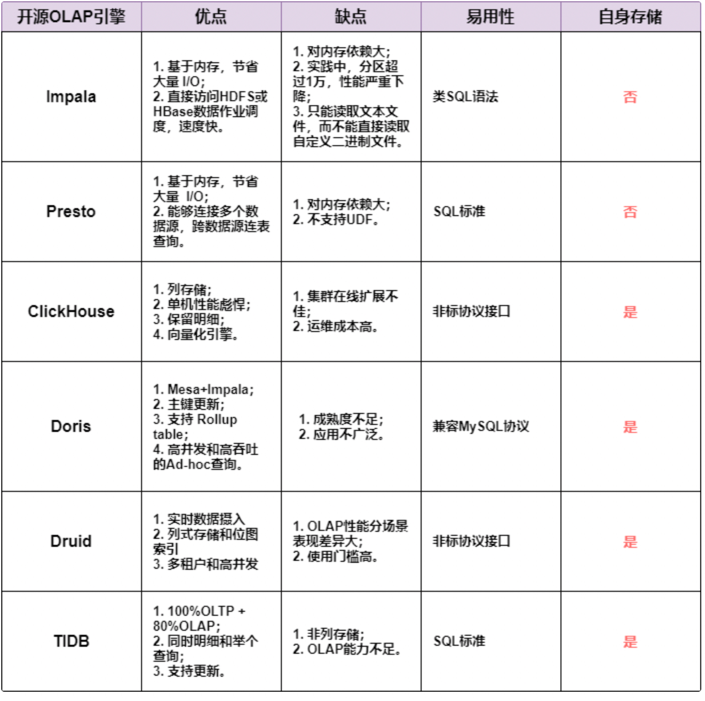

####用户画像
 - 用户画像建模
   + 统一化：统一用户的唯一标识
   + 标签化：给用户打标签
   + 业务化：将用户画像，指导业务关联
    
 - 用户消费行为分析
   + 用户标签：用户的基础属性
   + 消费标签：用户的消费习惯
   + 行为标签：用户行为使用习惯
   + 内容标签：分析的用户推荐
    
 - 用户生命周期三阶段
   + 获客：拉新
   + 黏客：个性化推荐
   + 留客：流失率预测
    
####系统架构角度的服务器分类
 - SMP 对称多处理器结构
```服务器多个CPU对称工作，无主次从属关系，资源共享，扩展能力有限```
 - NUMA 非一致存储访问结构
```
为解决SMP扩展不足，利用NUMA技术，将CPU组合在一台服务器
   每个CPU可以访问整个系统的内存（与MPP系统的重要区别）
   访问本地远快于其他节点（非一致存储访问的由来）
```
 - MPP 大规模并行处理结构
```
由多台SMP服务器连接，节点互联网络，完成相同任务，每个节点只能自己的资源，完全无共享
   某个Executor 执行过慢，导致整个集群慢，短板效应
```
#####批处理架构与MPP区别
 - 相同点：都属于分布式，Task 分配到节点计算后汇总
 - 不同点：MapReduce 是将 Task 随机分配到空闲的节点上计算，MPP是将 Task 分配到对应切片数据的节点上就近计算

#####MPP架构的OLAP引擎
 - Impala 只计算，不存储
 - Presto 低延时高并发内存计算引擎
 - ClickHouse 高效列式存储 + 计算
 - Doris 中等规模可扩展 KV 存储分析
 - Druid 亚秒列式实时数据分析存储
 - TiDB 同时支持 OLAP（不完善） OLTP 融合分布式数据库

   
#####ClickHouse去重
 - 去重：借助ReplacingMergeTree, 在合并Part的时候将主键（排序键）相同记录只保留一条，使用中可能存在问题：
   + 数据在分区part文件合并时去重，想要全局去重，需保证主键相同的记录在同一个节点同一个分区
   + ReplacingMergeTree 引擎的 merge 为不定期触发执行线程，非实时
   
 - 解决方案
   + ReplacingMergeTree + 定时触发脚本
   + ReplacingMergeTree + Final
   + MergeTree + argMax: argMax为ck聚合函数，未命中索引时，性能极差