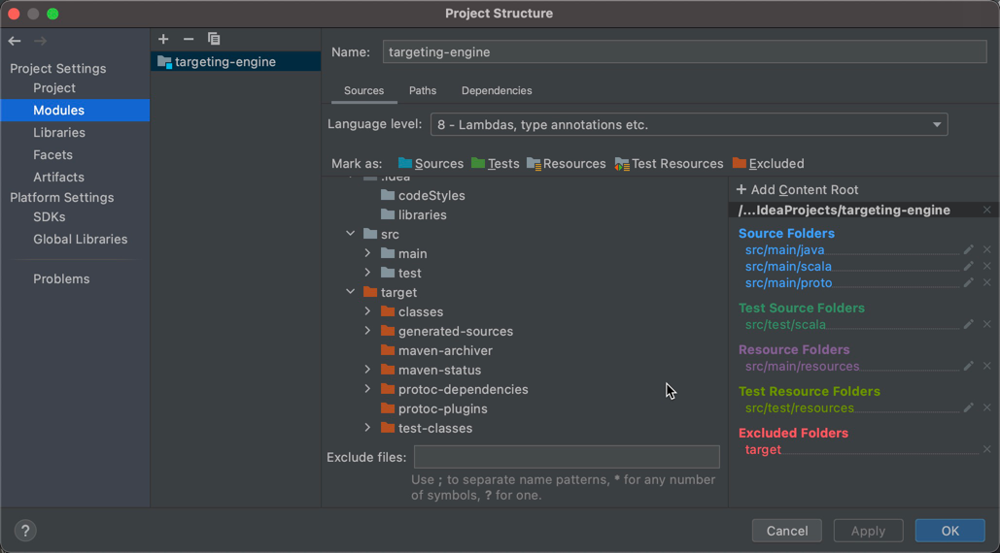

###今天从处理引用 PB 开始
 - Protobuf 文件经过 maven 编译后，生成到 target/generated-sources/protobuf/java/com/xxx
   
   + 生成的 class 文件无法被 source 目录下的 java/scala 文件引用(import)
   + 因为生成的文件目录为 exclude，无法被 classPath 文件读取，需要重新标记
   + mark generated-sources cancel exclude

 - Protobuf maven plugins 添加
```
<!-- Maven dependencies -->
<dependency>
	<groupId>com.google.protobuf</groupId>
	<artifactId>protobuf-java</artifactId>
	<version>${protobuf.version}</version>
</dependency>
<dependency>
	<groupId>com.google.protobuf</groupId>
	<artifactId>protobuf-java-util</artifactId>
	<version>${protobuf.version}</version>
</dependency>
<dependency>
	<groupId>com.twitter</groupId>
	<artifactId>chill-protobuf</artifactId>
	<version>0.5.2</version>
</dependency>


<!-- Add protobuf plugins -->
<plugin>
	<groupId>org.xolstice.maven.plugins</groupId>
	<artifactId>protobuf-maven-plugin</artifactId>
	<version>0.5.1</version>
	<extensions>true</extensions>
	<executions>
		<execution>
			<goals>
				<goal>compile</goal>
				<goal>test-compile</goal>
			</goals>
			<configuration>
				<protocArtifact>com.google.protobuf:protoc:${protobuf.version}:exe:${os.detected.classifier}</protocArtifact>
			</configuration>
		</execution>
	</executions>
</plugin>
```

 - maven shade plugin
    + https://www.jianshu.com/p/7a0e20b30401 简书详细描述
```
<build>
    <plugins>
      <plugin>
        <groupId>org.apache.maven.plugins</groupId>
        <artifactId>maven-shade-plugin</artifactId>
        <version>2.4.3</version>
        <executions>
          <execution>
            <phase>package</phase>  <!-- 打包阶段 -->
            <goals>
              <goal>shade</goal>   <!-- 生成 shade jar -->
            </goals>
            <configuration>
              <relocations>
                <relocation>
                  <pattern>org.codehaus.plexus.util</pattern>   <!-- 需要映射的 package 路径 -->
                  <shadedPattern>org.shaded.plexus.util</shadedPattern>  <!-- 映射后的 package 路径 -->
                  <excludes>    <!-- Exclude package 路径 -->
                    <exclude>org.codehaus.plexus.util.xml.Xpp3Dom</exclude>
                    <exclude>org.codehaus.plexus.util.xml.pull.*</exclude>
                  </excludes>
                </relocation>
              </relocations>
              <artifactSet>
			  	<excludes>  <!-- Exclude dependencies -->
			  		<exclude>org.apache.flink:force-shading</exclude>
			  		<exclude>com.google.code.findbugs:jsr305</exclude>
			  		<exclude>org.slf4j:*</exclude>
			  		<exclude>org.apache.logging.log4j:*</exclude>
			  	</excludes>
			  </artifactSet>
			  <filters>
			  	<filter>  <!-- Exclude file in META-INF -->
			  		<!-- Do not copy the signatures in the META-INF folder.
			  		Otherwise, this might cause SecurityExceptions when using the JAR. -->
			  		<artifact>*:*</artifact>
			  		<excludes>
			  			<exclude>META-INF/*.SF</exclude>
			  			<exclude>META-INF/*.DSA</exclude>
			  			<exclude>META-INF/*.RSA</exclude>
			  		</excludes>
			  	</filter>
			  </filters>
			  <transformers> <!-- Generate executable jar and config main class -->
			  	<transformer implementation="org.apache.maven.plugins.shade.resource.ManifestResourceTransformer">
			  		<mainClass>com.didi.map.StreamingJob</mainClass>
			  	</transformer>
			  </transformers>
            </configuration>
          </execution>
        </executions>
      </plugin>
    </plugins>
  </build>
```