##基本概念
 - jobmanager: 任务管理，请求资源，检查点
 - taskmanager:每个tm包含一定数量的slots,通过RM申请注册slots
 - ResourceManager:管理taskmanager的slots
 - dispatcher:webUI,提交应用,restful接口

 - 运行flink job对应的最小slots数为Task graph中最大并行度的步骤
 - 每个线程执行在固定的计算资源上，这个资源就是slot
 - slot之间内存是独享的，CPU不是，所以Slot数量最好分配成CPU数

 - 并行：
    - 数据并行->同一个任务，不同的并行子任务，同时处理不同的数据
    - 任务并行->同一时间，不同的slot在执行不同的任务

 - 并行度相同，one-to-one操作可合并

##流转换
 - 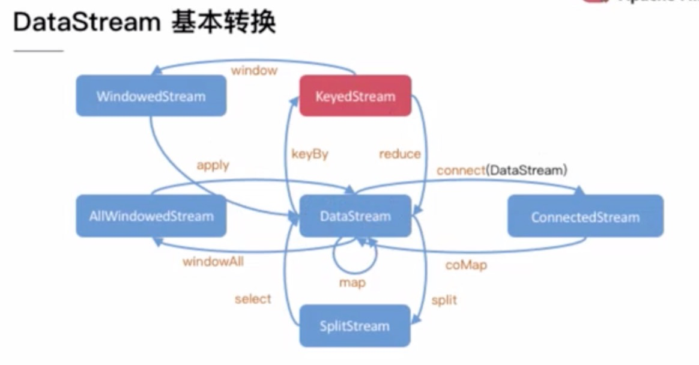

##算子操作
 - slotSharingGroup("a1") 相同共享组才能放在同一slot执行，其前面的算子组为”default“， 后续和a1相同
 - disableChaining 算子前后不能合并
 - startNewChain 算子跟前面不能合并，可以与后面算子合并
 - keyBy 基于key的hashcode重分区，同一个key只会在同一分区处理，之后所有的操作都仅指当前key下，如min
    ```
    keyGroup(一个分区可能包含多个key，key又合并为keyGroup)
    
    默认最大并行度1 << 7 = 128 DEFAULT_LOWER_BOUND_MAX_PARALLELISM
    assignKeyToParallelOperator(key, maxParallelism, parallelism)
    -> asignToKeyGroup(key, maxpara)
        -> computeKeyGroupForKeyHash(keyHash, maxPara)
            -> MathUtils.mururHash % maxPara
    -> computeOperatorIndexForKeyGroup
        -> keyGroupId * parallelism / maxPara
    ```
 - split + select 拆解流
    ```
    val splitStream = datastream.split( data => {
        if(data.id > 0) {
            seq("a")
        } else if(data.id < 0) {
            seq("b")
        } else seq("c")
    })
    
    val abStream = splitStream.select("a", "b")
    val cStream = splitStream.select("c")
    ```
 - connect + coMap 合并流（流数据类型可不同,两条流可共享状态,仅支持两条流）
    - 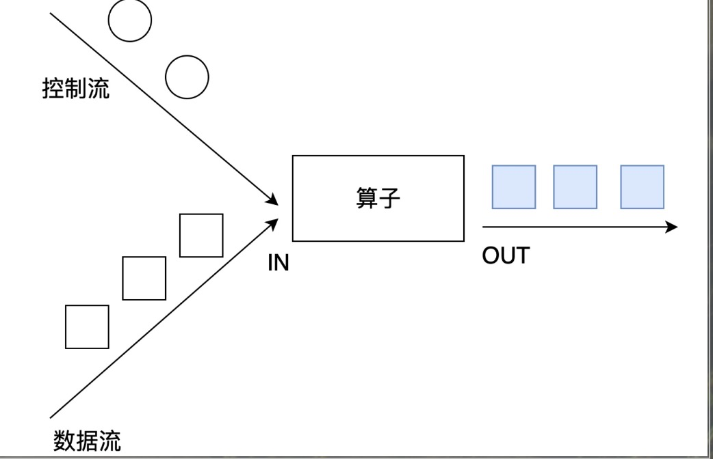
    - 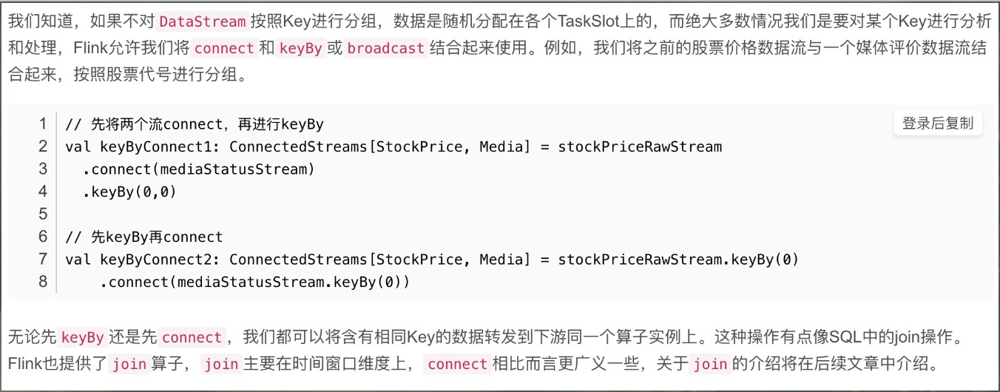
    ```
        val connectedStream: ConnectedStreams[(String, Double), (String, String)] = stream1.connect(stream2)
        connectedStream.map(
            streamData1 => (streamData1._1, "stream1"),
            streamData2 => (streamData2._1, "stream2")
        ).print("result")
        env.execute("connect stream")
        
        eg.
        stream1 => (a,1), (b,2)
        stream2 => (c,f)
        
        res:(不保证顺序) 
        (a, stream1), (c, stream2), (b, stream1)
    ```
 - union （可连接多条流，数据类型必须一样）
    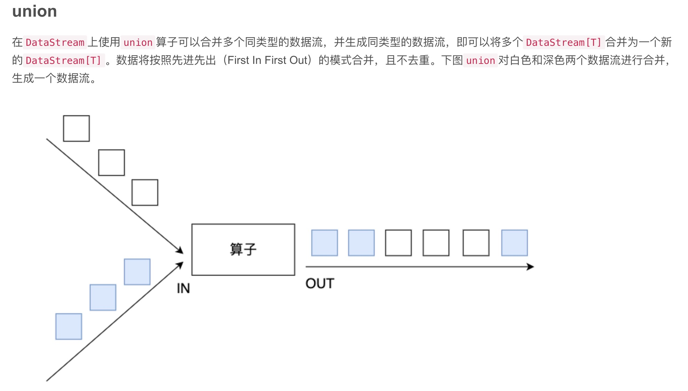    

##UDF函数
 - RichFunction 所有Flink函数类都有Rich版本，它可以获取运行环境上下文，并拥有生命周期方法，操作state
    ```
     class MyRichMapper extends RichMapFunction[In, Out] = {
        override def open(paramter: Configuration): Unit
        override def map(value: In): Out
        override def close(): Unit 
     }
    ```
    
##Sink
 - StreamingFileSink
    ```
        dataStream.addSink(
            StreamingFileSink.forRowFormat(
                new Path("xx"),
                new SimpleStringEncoder[String]("utf-8")
            ).build
        )
    ```
 - RedisSink (org.apache.bahir第三方支持 )
    ```
        val conf = new FlinkJedisPoolConfig.Builder
            .setHost("localhost")
            .setPort(6379)
            .build
        val mapper = new RedisMapper[String] {
            override def getCommandDescription
            override def getValueFromData
            override def getKeyFromData
        }
        datastream.addSink(new RedisSink[String](conf,mapper))
    ```
 - EsSink
    curl 'localhost:9200/_cat/indices?v'
    ```
        val httpHosts = new util.ArrayList[HttpHost]()
        httpHosts.add(new HttpHost("localhost", 9200))
        val esSinkFunc = new ElasticsearchSinkFunction[String] {
            override def process(element, ctx, indexer):Unit = {
                val datasource = new util.HashMap[String, String]()
                datasource.put("a", element.id)
                val indexRequest = Requests.indexRequest()
                    .index("ss1")
                    .`type`("r1")
                    .source(datasource) 
                indexer.add(ondexRequest)
            }
        }
        datastream.addSink(new ElasticsearchSink.Builder[String](httpHosts, esSinkFunc).build)
    ```
 - 自定义Sink
    ```
       class JdbcSink extends RichSinkFunction[String] {
            var conn: Connection = _
            var insertStmt: PreparedStatement = _
            var updateStmt: PreparedStatement = _
            
            override def open(param: Configuration): Unit = {
                conn = DriverManager.getConnection(xx)
                insertStmt = conn.preparedStatement(xx)
                updateStmt = conn.preparedStatement(xx)
            }
            
            override def invoke(value: String, context: SinkFunction.Context[_]): Unit = {
                updateStmt.setString(xx)
                updateStmt.execute()
                if (updateStmt.getCount == 0) {
                    insertStmt.setString(1, value)
                    insertStmt.execute()
                }
            }
            
            override def close(): Unit = {
                conn.close
            }
       }
    ```
    
##Flink window
 - window: 将无限流切个为有限流，将数据放在有限的桶内，左闭右开 [0, 5)
 - window类型
    - 时间窗口(Time Window)
        - 滚动时间窗口: 时间对齐，窗口长度固定，没有重叠
        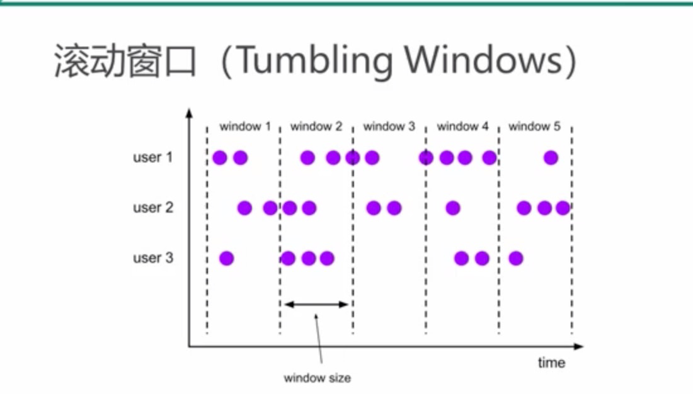
        - 滑动时间窗口:（固定窗口长度 + 滑动间隔） 长度固定，可以有重叠
        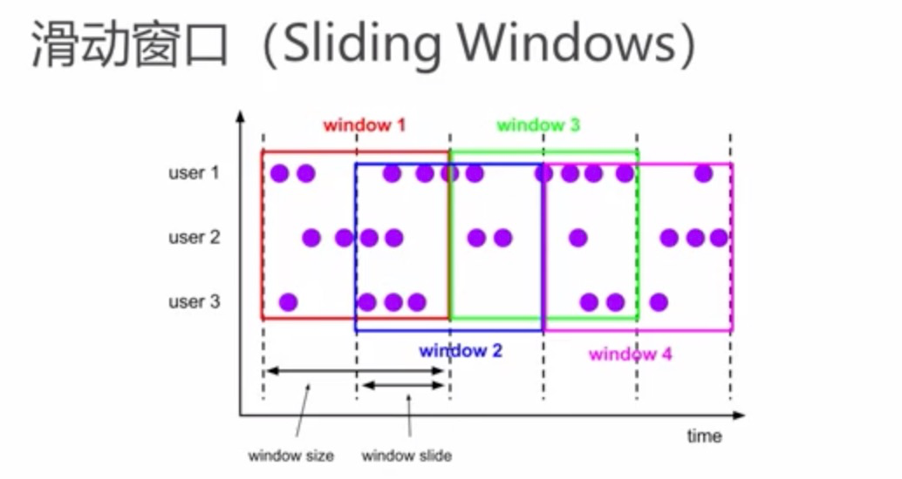
        - 会话窗口: 指定时间长度timeout的间隙，连续来的数据在同一个session，时间无对齐
        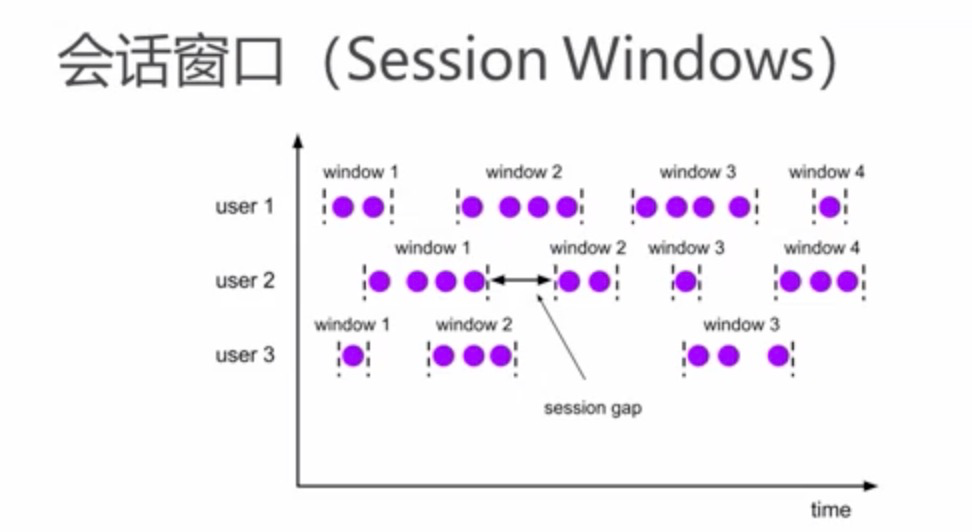
    - 计数窗口(Count Window)
        - 滚动计数窗口
        - 滑动计数窗口
 - window function
    - 增量聚合函数（incremental aggregation functions）
        - 每条数据来都进行计算，保存一个简单的状态
        - ReduceFunction AggregateFunction
    - 全窗口函数（full window functions）
        - 先把窗口所有数据收集起来，等到计算的时候执行所有数据
        - ProcessWindowFunction
 - 可选Api
    - trigger: 定义window什么时候关闭，触发计算输出结果
    - evictor: 定义移除某些数据的逻辑
    - allowedLateness: 允许处理迟到数据
    - sideOutputLateData: 将迟到数据放入侧数据流
    - getSideOutput: 获取侧输出流
 - .window前必须有keyby（windowAll除外）, .window后必须有reduce/aggregate/fold/apply
    ```
        // Time Window
        dataStream.keyBy(id).timeWindow(Time.seconds(10)).reduce(new Reducer())
        
        // Full Window
        class MyWindowFunc() extends WindowFunction[String, (Long, Int), Tuple, TimeWindow] {
            override def apply(key: Tuple, window: TimeWindow, input: Iterable[String], out: Collector[(Long, Int)]) {
                out.collect(window.getStart, input.size)
            }
        }
        dataStream.keyBy("id").timeWindow(Time.seconds(10), Time.seconds(2))
            .apply(new MyWindowFunc)
    ```
 - Window assigner
    ```
        .window(EventTimeSessionWindows.withGap(Time.minutes(1)))
        .window(TumblingProcessingTimeWindows.of(Time.days(1), Time.hours(16)))
        .countWindow(10, 2) // 10个数统计一次，window间隔2
    ```
 - TumblingEventTimeWindows offset参数
    - flink某些低版本1.6.2出现报错：java.lang.IllegalArgumentException: TumblingEventTimeWindows parameters must satisfy 0 <= offset < size
    - TumblingEventTimeWindows.of(Time.days(1),Time.hours(-8)) 会出现以上报错
    - 解决方法：使用TumblingEventTimeWindows.of(Time.days(1),Time.hours(16))代替
    - https://github.com/apache/flink/pull/5376 已经修复
 - Window Start Timestamp
    => timestamp - (timestamp - offset + windowSize) % windowSize
    - SlidingEventTimeWindow (windowSize = slide)
        - TimeWindow.getWindowStartWithOffset(timestamp, offset, slide)
    - TumblingEventTimeWindow (windowSize = size)
        - TimeWindow.getWindowStartWithOffset(timestamp, offset, size)
 - 时间语义
    - Event time: 事件创建时间
        ```
            env.setStreamTimeCharacteristic(TimeCharacteristic.EventTime)
            dataStream.assignAscendingTimestamps(_.timestamp * 1000L)
        ```
    - Ingestion time: 数据进入Flink时间
    - Processing time: 执行操作算子的本地系统时间（程序默认的时间语义）
    - 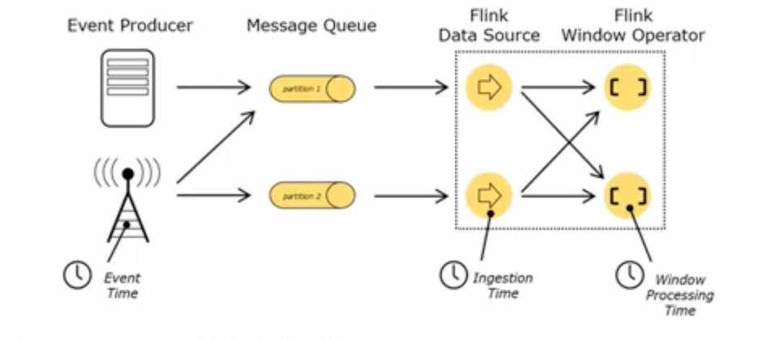
    - 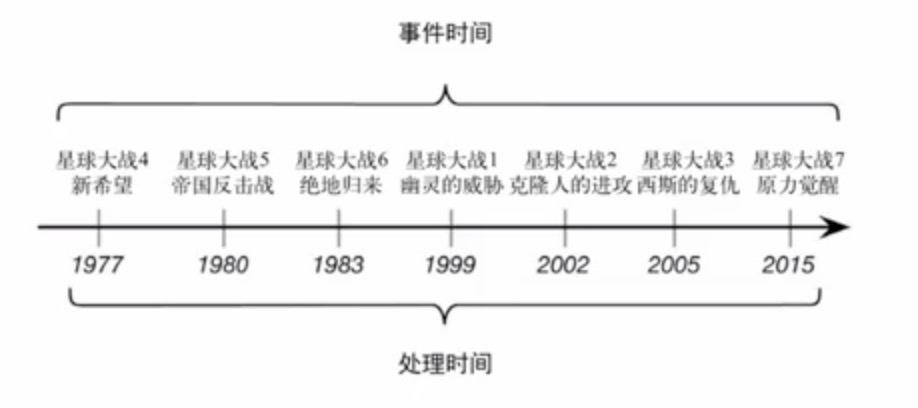
 - 乱序数据影响
    - 当flink以EventTime模式处理数据流时，会根据数据里的时间戳来处理基于时间的算子
    - 由于网络，分布式等，会导致乱序数据的产生
 - Watermark
    - 衡量EventTime进展的机制，可以设定延迟触发
    - 用于处理乱序事件，通常使用watermark + window实现
    - 数据流中的watermark用于表示timestamp小于watermark的数据都已经到达，window的执行也是由watermark触发
    - watermark用来使程序平衡延迟和结果正确性
    - watermark是一条特殊的数据记录
    - watermark 必须单调递增，以确保任务的事件时间在向前推进，不是后退
    - watermark与数据的时间戳相关
 - Watermark传递
    - 多个分区对应不同的watermark，下游广播watermark时按照最小的watermark进行处理
 - AssignTimestampsAndWatermarks
    - 乱序处理
        - 窗口有两个重要操作：触发计算，清空状态（关闭窗口）
        ```
         .assignTimestampsAndWatermarks(new BoundedOutOfOrdernessTimestampExtractor[String](Time.seconds(10)){ // 最大乱序程度10s
            override def extractTimestamp(element: String): Long = { // 指定时间戳
                element * 1000L
            }
            
         }).setParallelism(2) // 需要考虑算子不同分区watermark传递的情况
         .allowedLateness(Time.minutes(1)) // 允许延迟1分钟，之前的窗口正常计算，来一条延迟数据，和之前的计算结果叠加一次
         .sideOutputLateData(new OutputTag[String]("late"))
         
         resultStream.getSideOutput(new OutputTag[String]("late"))
        ```
        - 自定义周期性生成watermark的Assigner: 周期性生成watermark插入流中，默认周期200ms
        ```
        env.getConfig.setAntoWatermarkInterval(100L) // 默认更新周期为200ms
        class MyWaterMarkAssigner(lateness: Long) extends AssignerWithPeriodicWatermarks[Bean]{
            // 需要两个关键参数，延迟时间，和当前所有数据中最大的时间戳
            var maxTs: Long = Long.MinValue + lateness
            
            override def getCurrentWatermark: Watermark = new Watermark(maxTs - lateness)
            
            override def extractTimestamp(element: Bean, previousElementTimestamp: Long): Long = {
                maxTs = maxTs.max(element.timestamp * 1000L)
                element.timestamp * 1000L
            }
        }
        ```
        - 自定义断点式生成watermark的Assigner
        ```
        class MyPunctWatermarkAssigner extends AssignerWithPunctuatedWatermarks[Bean]{
            val lateness = 1000L
            override def checkAndGetNextWatermark(lastElement: Bean, extractedTimestamp: Long): Long = {
                if(lastElement.id == "bean 1") {
                    new Watermark(extractTimestamp - lateness)
                } else null
            }
            override def extractTimestamp(element: Bean, previousElementTimestamp: Long): Long = {
                element.timestamp * 1000L
            }
        } 
        ```
 - ProcessFunction
    - 普通的Transform算子，只能获取到当前的数据，或者加上聚合状态【不能获取时间戳和watermark相关信息】
    - RichFunction，可以有生命周期方法，还可以获取运行时上下文，进行状态编程【不能获取时间戳和watermark相关信息】
    - Process Function 是唯一可以获取到时间相关信息的API
        - extends AbstractRichFunction,包含其所有api
        - 可以获取timestamp和watermark
        - 可以注册定时器，指定某个时间点发生的操作
        - 可以输出测输出流
        ```
        // 检测每个传感器温度是否在10s内连续上升
        val warningStream = dataStream.keyBy("id")
            .process(new TempIncrWarning(10000L))
        warningStream.print()
        env.execute("process function job")
        
        class TempIncreWarning(interval: Long) extends KeyedProcessFunction[Tuple, SensorReading, String] {
            // 由于需要与之前的温度值对比，需要保存上一个温度成状态
            lazy val lastTempState: ValueState[Double] = getRuntimeContext.getState(new ValueStateDescriptor[Double]("lastTemp", classOf[Double]))
            // 为了方便删除定时器，需要保存定时器的时间戳
            lazy val currTimerTsState: ValueState[Long] = getRuntimeContext.getState(new ValueStateDescriptor[Long]("cur_timer", classOf[Long]))
            
            override def processElement(value: SensorReading, ctx: KeyedProcessFunction[Tuple, SensorReading, String]#Context, out: Collector[String]): Unit = {
                val lastTemp = lastTempState.value
                val curTimerTs = currTimerTsState.value
                // 将上次温度值的状态更新为当前数据的温度值
                lastTempState.update(value.temperature)
                // 判断当前温度值，如果比之前温度高，并且没有定时器，注册10s后的定时器
                if (value.temperature > lastTemp && currTimerTs == 0) {
                    val ts = ctx.timerService().currentProcessingTime() + interval
                    ctx.timerService().registerProcessingTimeTimer(ts)
                    currTimerTsState.update(ts)
                } else if (value.temperature < lastTemp){
                    ctx.timerService().deleteProcessingTimeTimer(currTimerTs)
                    // 清空状态
                    currTimerTsState.clear()
                }
                
                ctx.timerService().registerEventTimeTimer()
            }
            override def onTimer(timestamp: Long, ctx: KeyedProcessFunction[Tuple, SensorReading, String]#OnTimerContext, out: Collector[String]) = {
                out.collect("温度值连续上升" + interval / 1000 + "s")
                currTimeTs.clear()
            }
        }
        ```

2021.3.30

- 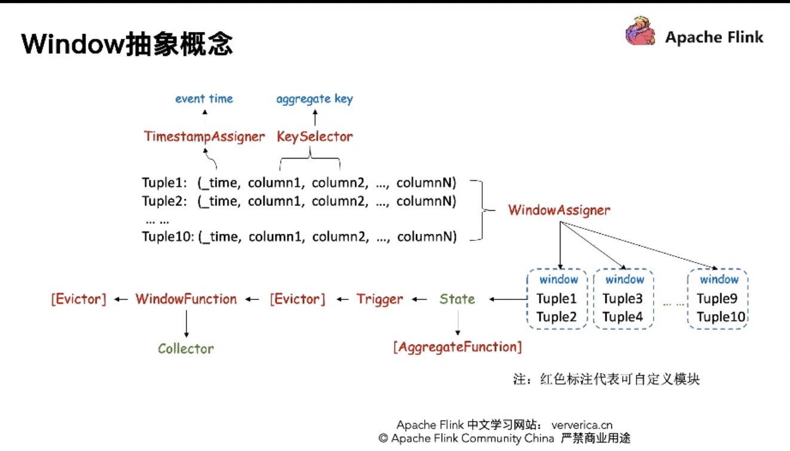

执行顺序：
- 编程接口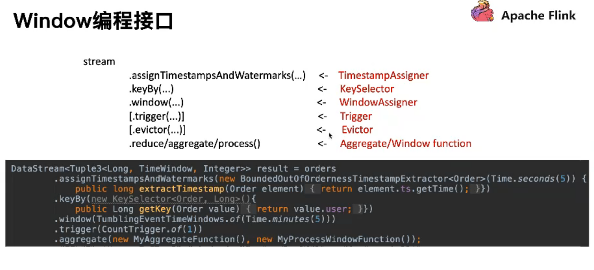
- Assigner
- Trigger

Window Evictor
CountEvictor: 窗口计算时，只保留最近N条element
TimeEvictor: 窗口计算时，只保留最近N段事件范围的element
DeltaEvictor: 窗口计算时，最新的一条element 于其他element 做delta计算，只保留delta在threshold 内的element

Window Operator工作流程：
1.获取element归属的windows
2.获取element对应的key
3.如果late data, 跳过
4.将element 存入window state
5.判断element 是否触发trigger
6.获取window state, 注入window function
7.清楚window state
8.注册timer, 到窗口结束时间清理window


Window State
ListState: process(...)/evitor(...)
AggregatingState: reduce(...)/aggregate

Window trigger
从processingTimeTimersQueue获取时间最早的一个Timer进行注册，比对触发后再从队列获取最早的那个Timer


2021.3.23


一.资源管理

1. Slot Sharing：（Flink 1.10及以下）
   Slot Sharing Group 中的任务可共用slot
   默认所有节点在一个Slot Sharing Group 中
   一个Slot中相同的任务只能有一个
   运行一个作业所需的Slot数为最大并发数
   相对负载均衡

   结论：
   自顶向下的资源管理
   1.配置Job整体资源
   2.配置简单，易用性强，适合拓扑简单和规模较小的作业
   3.资源利用率非最优
   4.对资源的不确定性


2. 细粒度资源管理：
   算子的资源需求是已知的
   每个Task独占一个Slot

细粒度资源管理  ->   动态Slot切分(共用Slot)  ->  动态Slot 切分（共用整块资源）
 - 碎片化问题：
   + （1）根据SlotRequest资源需求定制TM资源,彻底杜绝资源碎片化
   >代价：延长作业调度时间
   >> 收到SlotRequest才能申请资源，响应时间相对较长;
   >> TM资源难以复用，因为不能保证每次申请的资源都是相同大小
   + （2）流和批的不同需求
      - Streaming:
      ```
      一次调度，长期运行
      提高资源利用率的收益高
      适合采用定制TM资源的调度策略
     ```
      - Batch:
      ```
      频繁调度，运行时间短
      对调度延迟敏感
      适合采用非定制化TM资源的策略
     ```


细粒度资源下的资源调优：
 - 自底向上的资源管理
 - 配置Task资源需求难度较高
Spark根据负载弹性伸缩集群的策略

Flink解决均衡问题：
1. 改进Task策略，尽可能保证算子Task在TM间均衡 
2. Flink按照历史实际使用峰值申请
3. YARN报障按照自愿分配率尽可能均衡
4. 当有机器扩缩容时，产出重新均衡的作业调整计划